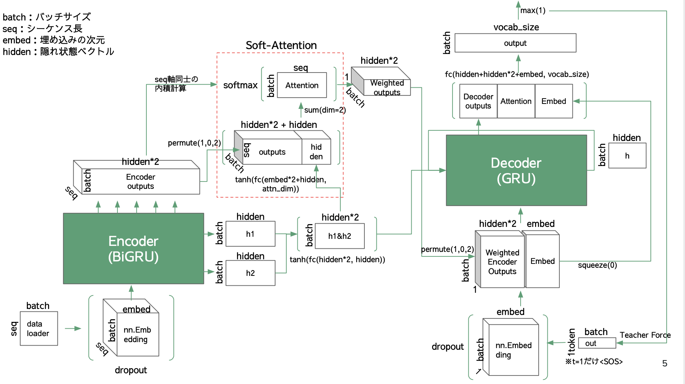

## 概要

- RNN-SearchをもとにしたSeq2Seqモデルの実装。
- Soft-Attentionを理解するために実装。
- EncoderはBiGRU、DecoderはGRU。

論文はこちら

https://arxiv.org/pdf/1409.0473.pdf

## 準備

1. 下記を実行してトークナイザを利用できるようにする。
    ```
    python -m spacy download en
    python -m spacy download de
    ```

2. 下記を実行する。

    ```
    python -m src.main
    ```

## 構造




